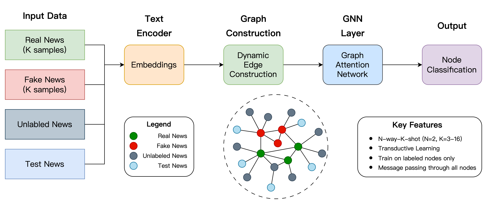

# DynGraph-GAT: Adaptive Edge Construction for Content-Based Few-Shot Fake News Detection

This paper is accepted by the 2025 ITAOI (The 23rd Conference on Information Technology and Application in Outlying Islands) conference.

Authors:
- [Chen-Yang Yu](https://github.com/LittleFish-Coder) (First Author)
- [Chih-Yun Lin](https://github.com/salmoniscute)
- [Cheng-Te Li](https://sites.google.com/view/chengteli/) (Advisor)

check the paper [here](./ITAOI.pdf) and slides [here](./DynGraph-GAT.pdf).
